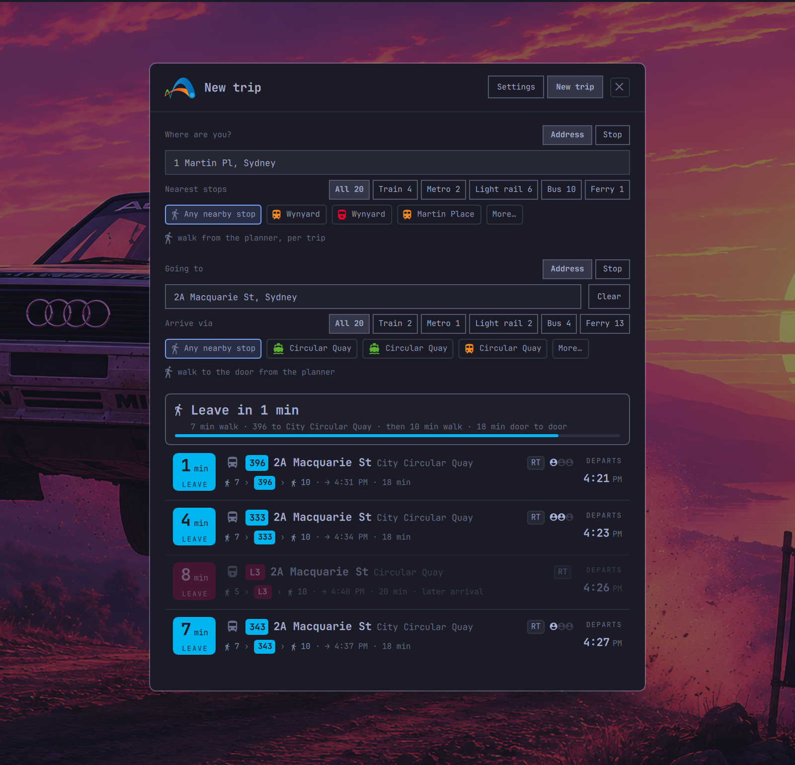

# Transport NSW departures for Omarchy

A shell plugin that puts the next catchable Transport for NSW service or trip in
the Omarchy bar. Everything counts down in **leave in** time: departure time
minus your walk to the stop. The bar shows just the Transport mark; the popup
shows the leave window closing. The popup shows departures, arrivals, travel time, platforms,
realtime delays, cancellations and disruption alerts. The New trip view accepts
stops or addresses at both ends, includes nearby bus stops, and keeps planning
from the address when no stop is nearby. Destination addresses include the final
walk to the door.

The popup follows a station indicator-board layout: line-colour badges lead each
destination, compact pills show realtime and change status, and expanded trips
become mini boards with per-leg platforms, clocks and bounded stop sequences.
The hero's trip selector keeps the active route immediately available, while
the leave-window strip shows the allocated walk and next line without competing
with the countdown.

Crowding is shown as three people icons on planned trips when live vehicle data
is available. Bus and Metro coverage is reliable, train coverage is sparse,
and light rail has no crowding feed. Departure-only boards do not show crowding
because their identifiers cannot be joined to the vehicle-position feeds.

| Bar | Departures popup |
|:---:|:---:|
|  |  |
| **Settings** | **New trip** |
|  |  |

## Install

```bash
omarchy plugin add https://github.com/vichong/omarchy-tfnsw-departures.git --enable --yes
```

Plugins run inside the shell process. Review third-party plugin code before
enabling it.

### Dependencies

All present on a stock Omarchy install: `curl` (HTTPS calls to
`api.transport.nsw.gov.au` only, no redirects), `secret-tool` from libsecret
(stores the API key in the system keyring), `nmcli` from NetworkManager
(optional, reads the current Wi-Fi SSID for automatic trip switching) and
Omarchy's own `omarchy-notification-send`. API and keyring helpers use
`scripts/tfnsw-bounded` or curl's response cap. Runtime `mkdir`, notifications,
Wi-Fi checks and cache reads use fixed argument arrays, deadlines, and capped
reads where output is consumed. No sudo or pkexec is required. There is no
installer and no bundled binary. Plugin-managed persistent files stay under
`~/.config/omarchy/tfnsw-departures/` and
`~/.cache/omarchy/tfnsw-departures/`; the API key is stored separately by the
system keyring. `scripts/build-stops` is a developer tool that rewrites
`data/stops.json` in the repository.

## Get a Transport NSW API key

1. Register for TfNSW Open Data and open **Applications**.
2. Add an application, choose the Bronze plan (60,000 calls/day), and tick
   **Trip Planner APIs**.
3. Copy the API key, open the widget's settings, paste it, and select Connect.

The key is stored in the system keyring under `service=tfnsw-departures` and
`account=apikey`. It is never written to the config file. Demo mode needs no
key and makes no network calls.

## Setup

Stations, light rail stops and ferry wharves are suggested as you type from a
bundled list, while addresses, landmarks and bus stops come from the live stop
finder once at least three characters have been entered.

Add a trip and choose **Address** or **Stop** independently for each end. Address
ends show nearby stops and an estimated walk; untick **estimate** to keep and
edit your own walking time. Leave **Going to** empty for a live departure board,
or choose a destination to plan a trip through the selected stops and any final
walk to the door.
The trip selector shows the saved nickname with its route underneath. Trip rows
lead with your saved destination, keep the vehicle headsign secondary, and read the journey as a
chain underneath: walk › line › walk, then the arrival time and platform.
An address end can be **Any nearby stop**: the planner picks the best stop
for each journey, so buses, trains and light rail from the same address
compete on one board, each with its own walk. Pin a stop chip instead to
plan from that stop with your own walk time.
Expanding a row opens an indicator board that mirrors the chain: when to
leave, each leg with its departure and platform, and the change in between.

### Trips with changes

Trip rows show the first service and its direction. Click a row, or select it
and press Enter, to expand every ride, walk and transfer; only one trip stays
expanded at a time. Per-leg platforms, realtime status and disruption alerts
remain attached to the service they affect.

You can optionally filter lines, destination text and modes, then set the walking
time. Each trip is edited in its own card, with service filters behind a compact
disclosure; empty line, destination and mode filters display as **All**.
The bar mark can remain monochrome with the rest of Omarchy or use the TfNSW
gradient. Leave-now notifications and polling (30–600 seconds) are configurable.

Configuration lives at
`~/.config/omarchy/tfnsw-departures/config.json`:

```json
{
  "demoMode": false,
  "places": [{
    "id": "home",
    "name": "Home",
    "stopId": "204420",
    "stopName": "Sydenham Station",
    "destStopId": "200080",
    "destStopName": "Wynyard Station",
    "destAddress": "1 Martin Pl, Sydney",
    "destLat": -33.8675,
    "destLon": 151.2078,
    "destWalkMinutes": 4,
    "destWalkEstimated": true,
    "lines": ["T4", "T8"],
    "destination": "City",
    "modes": ["train", "metro"],
    "walkMinutes": 5,
    "walkEstimated": false,
    "ssid": "Home Wi-Fi"
  }],
  "activePlaceId": "home",
  "autoPlace": true,
  "pollSeconds": 60,
  "notify": true,
  "colorful": false
}
```

With Wi-Fi auto-switch enabled, an exact SSID match selects that trip unless
you manually selected a trip in the previous 30 minutes.

## Bar widget

The bar shows only the Transport mark, flat and static like the stock widgets,
plus a warning glyph while a disruption alert is active. Hover for the full
countdown, arrival time and trip. Open the popup and the **leave window**
under the hero shows how much of your ten-minute window is gone, as a track in
the next service's line colour with “Leave in 4 min” above “6 min walk · L2 to
Circular Quay”.

To show the countdown text in the bar instead, set it on the widget entry in
`~/.config/omarchy/shell.json`:

```json
{ "id": "io.github.vichong.tfnsw-departures", "showCountdown": true }
```

## Keyboard

In the popup, `↑`/`↓` or `j`/`k` moves through departures, `←`/`→` changes
trip, Enter expands or collapses the selected journey, `Esc` closes, and `Tab`
moves to the next panel.

## IPC scripting

```bash
omarchy-shell tfnsw status
omarchy-shell tfnsw next
omarchy-shell tfnsw refresh
omarchy-shell tfnsw place home
omarchy-shell tfnsw open
omarchy-shell tfnsw newtrip        # open New trip
omarchy-shell tfnsw newtripUse     # Use now (with a planned trip open)
omarchy-shell tfnsw newtripSave    # Save as trip
omarchy-shell tfnsw placeFrom "<text>"  # Settings: search Leaving from and pick the first result
omarchy-shell tfnsw expand 1       # expand the second row into its indicator board
omarchy-shell tfnsw menu           # open the trip dropdown
omarchy-shell tfnsw here
omarchy-shell tfnsw settings
```

`here` remains an alias for `newtrip` for existing scripts.

## Remove

Remove the key in Settings first if desired, then:

```bash
omarchy plugin remove io.github.vichong.tfnsw-departures --yes
```

## Data and attribution

Transport data is sourced from **TfNSW Open Data** and used under the Creative
Commons Attribution 4.0 International licence (**CC BY 4.0**). Attribution:
Transport for NSW.

Not affiliated with Transport for NSW.

## Notes for developers

The bundled `data/stops.json` list is rebuilt from the GTFS schedule feeds with
`scripts/build-stops`; it is a developer-only data maintenance tool and is not
run by the plugin.

The Trip Planner API's `itdTime` fields are local Sydney time, despite other API
timestamps using UTC-style representations. Do not reinterpret `itdTime` as UTC
before constructing a local `Date`, or departures will move by the timezone
offset.

The checked-in response fixtures are:

- `tests/fixtures/add_info_current.json`
- `tests/fixtures/departure_mon_sydenham.json`
- `tests/fixtures/stop_finder_address.json`
- `tests/fixtures/stop_finder_sydenham.json`
- `tests/fixtures/trip_address_to_wynyard.json`
- `tests/fixtures/trip_sydenham_to_wynyard.json`
