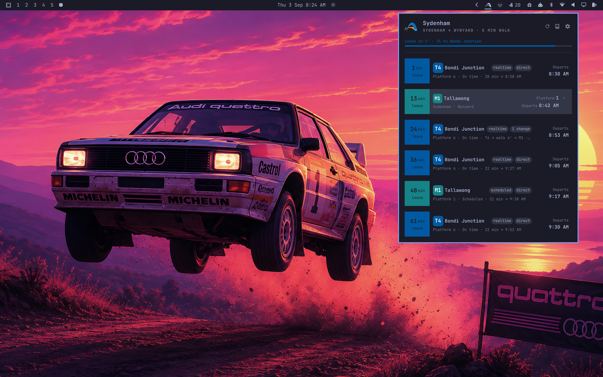
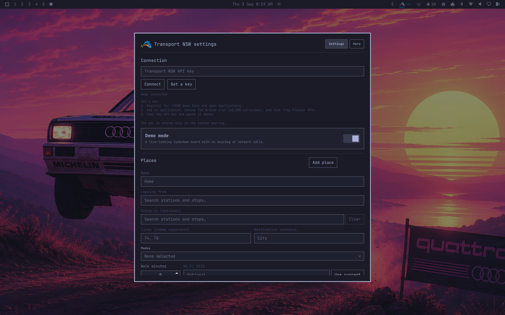
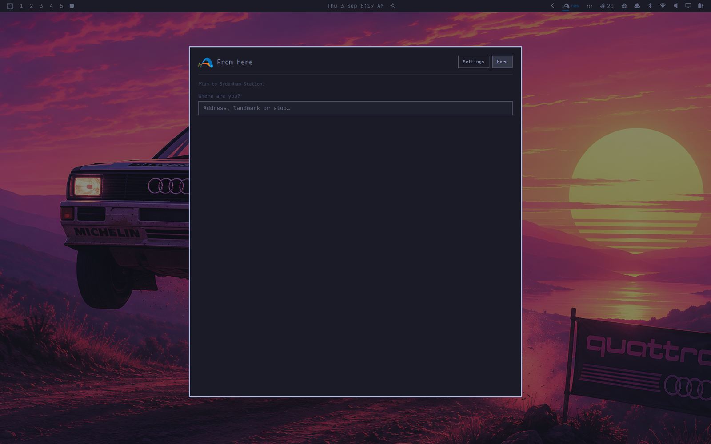

# Transport NSW departures for Omarchy

A shell plugin that puts the next catchable Transport for NSW service or trip in
the Omarchy bar. Everything counts down in **leave in** time: departure time
minus your walk to the stop. The bar shows just the Transport mark; the popup
shows the leave window closing. The popup shows departures, arrivals, travel time, platforms,
realtime delays, cancellations and disruption alerts; the Here view plans a trip
back to your active place.

The popup follows a station indicator-board layout: line-colour badges lead each
destination, compact pills show realtime and change status, and expanded trips
become mini boards with per-leg platforms, clocks and bounded stop sequences.
The hero's place selector keeps the active route immediately available, while
the leave-window strip shows the allocated walk and next line without competing
with the countdown.

| Bar | Departures popup |
|:---:|:---:|
|  |  |
| **Settings** | **From here** |
|  |  |

## Install

```bash
omarchy plugin add https://github.com/vichong/omarchy-tfnsw-departures.git --enable --yes
```

Plugins run inside the shell process. Review third-party plugin code before
enabling it.

### Dependencies

All present on a stock Omarchy install: `curl` (HTTPS calls to
`api.transport.nsw.gov.au` only, no redirects), `secret-tool` from libsecret
(stores the API key in the system keyring), `nmcli` from NetworkManager
(optional, reads the current Wi-Fi SSID for automatic place switching) and
Omarchy's own `omarchy-notification-send`. Child processes run through
`scripts/tfnsw-bounded`, which caps their output. No sudo or pkexec, no
installer, no bundled binaries, no writes outside
`~/.config/omarchy/tfnsw-departures/` and `~/.cache/omarchy/tfnsw-departures/`.

## Get a Transport NSW API key

1. Register for TfNSW Open Data and open **Applications**.
2. Add an application, choose the Bronze plan (60,000 calls/day), and tick
   **Trip Planner APIs**.
3. Copy the API key, open the widget's settings, paste it, and select Connect.

The key is stored in the system keyring under `service=tfnsw-departures` and
`account=apikey`. It is never written to the config file. Demo mode needs no
key and makes no network calls.

## Setup

Stations, light rail stops and ferry wharves are suggested as you type from a
bundled list, while addresses, landmarks and bus stops come from the live stop
finder once at least three characters have been entered.

Add a place and search for its origin stop. Leave **Going to** empty for a live
departure board, or choose a destination stop to turn the place into a trip.
The place selector makes the distinction explicit: `From Home` is a departure
board, while `Home → Wynyard` is a planned trip. Trip rows lead with your saved
destination, keep the vehicle headsign secondary, and show arrival and travel
time in the caption.

### Trips with changes

Trip rows show the first service and its direction. Click a row, or select it
and press Enter, to expand every ride, walk and transfer; only one trip stays
expanded at a time. Per-leg platforms, realtime status and disruption alerts
remain attached to the service they affect.

You can optionally filter lines, destination text and modes, then set the walking
time. Each place is edited in its own card, with service filters behind a compact
disclosure; empty line, destination and mode filters display as **All**.
The bar mark can remain monochrome with the rest of Omarchy or use the TfNSW
gradient. Leave-now notifications and polling (30–600 seconds) are configurable.

Configuration lives at
`~/.config/omarchy/tfnsw-departures/config.json`:

```json
{
  "demoMode": false,
  "places": [{
    "id": "home",
    "name": "Home",
    "stopId": "204420",
    "stopName": "Sydenham Station",
    "destStopId": "200080",
    "destStopName": "Wynyard Station",
    "lines": ["T4", "T8"],
    "destination": "City",
    "modes": ["train", "metro"],
    "walkMinutes": 5,
    "ssid": "Home Wi-Fi"
  }],
  "activePlaceId": "home",
  "autoPlace": true,
  "pollSeconds": 60,
  "notify": true,
  "colorful": false
}
```

With Wi-Fi auto-switch enabled, an exact SSID match selects that place unless
you manually selected a place in the previous 30 minutes.

## Bar widget

The bar shows only the Transport mark, flat and static like the stock widgets,
plus a warning glyph while a disruption alert is active. Hover for the full
countdown, arrival time and place. Open the popup and the **leave window**
under the hero shows how much of your ten-minute window is gone, as a track in
the next service's line colour with “Leave in 4 min” above “6 min walk · L2 to
Circular Quay”.

To show the countdown text in the bar instead, set it on the widget entry in
`~/.config/omarchy/shell.json`:

```json
{ "id": "io.github.vichong.tfnsw-departures", "showCountdown": true }
```

## Keyboard

In the popup, `↑`/`↓` or `j`/`k` moves through departures, `←`/`→` changes
place, Enter expands or collapses the selected trip, `Esc` closes, and `Tab`
moves to the next panel.

## IPC scripting

```bash
omarchy-shell tfnsw status
omarchy-shell tfnsw next
omarchy-shell tfnsw refresh
omarchy-shell tfnsw place home
omarchy-shell tfnsw open
omarchy-shell tfnsw here
omarchy-shell tfnsw settings
```

## Remove

Remove the key in Settings first if desired, then:

```bash
omarchy plugin remove io.github.vichong.tfnsw-departures --yes
```

## Data and attribution

Transport data is sourced from **TfNSW Open Data** and used under the Creative
Commons Attribution 4.0 International licence (**CC BY 4.0**). Attribution:
Transport for NSW.

Not affiliated with Transport for NSW.

## Notes for developers

The bundled `data/stops.json` list is rebuilt from the GTFS schedule feeds with
`scripts/build-stops`; it is a developer-only data maintenance tool and is not
run by the plugin.

The Trip Planner API's `itdTime` fields are local Sydney time, despite other API
timestamps using UTC-style representations. Do not reinterpret `itdTime` as UTC
before constructing a local `Date`, or departures will move by the timezone
offset.

The checked-in response fixtures are:

- `tests/fixtures/add_info_current.json`
- `tests/fixtures/departure_mon_sydenham.json`
- `tests/fixtures/stop_finder_address.json`
- `tests/fixtures/stop_finder_sydenham.json`
- `tests/fixtures/trip_address_to_wynyard.json`
- `tests/fixtures/trip_sydenham_to_wynyard.json`
